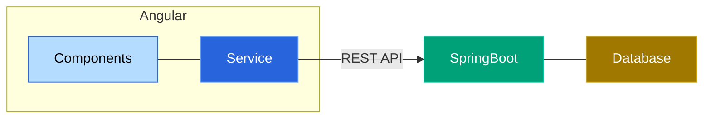
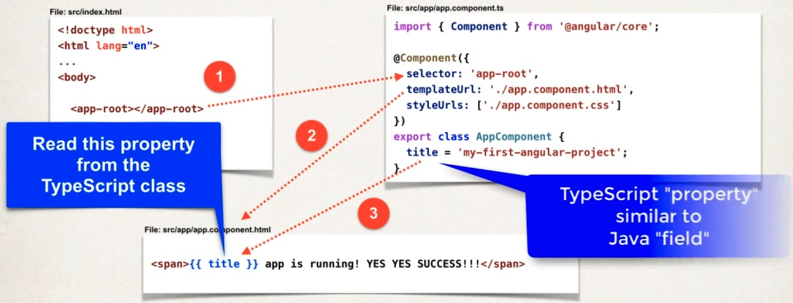

# Introduction

[Angular](www.angular.io) is a framework for building applications supporting partial refresh

- Component based framework
- Clean separation of view templates and application logic
- Built-in support for data-binding and dependency injection (DI)
- Supports response web-design (Bootstrap, Google material design)

## Terminologies

| Term          | Description                                                  |
| ------------- | ------------------------------------------------------------ |
| Component     | Building block of angular application consisting of<br />A) View for user interface <br />B) Class containing application logic and event handling (events occurring on view) |
| View Template | HTML user interface for the component (with dynamic elements) |
| Directive     | Elements like conditionals and loop that alter view rendering |
| Service       | A class injected to provide a desired service like<br />- Retrieve data from a remote server<br />- Perform calculation<br />- Perform validation |
| Module        | A collection of components, directives, services and so on.  |

## Full stack overview



- Frontend: Angular HTML view components 
- Backend: A spring boot application that queries database
- A service uses REST API to get data. A service is injected into the component using Dependency Injection (DI) provided by Angular framework. Thus completing the full stack.

# Angular 

Angular Typescript (AngularTS) project needs node and node packages like typescript and angular

## Installation

### Packages to install

- First install NVM ([Node Version Manager](https://github.com/nvm-sh/nvm))
- Use NVM to install node `nvm install node` (This also installs NPM or Node PackageManager)
- NPM is used to install all packages
  - typescript `npm install -g typescript`
  - angular-cli `npm install -g @angular/cli`

### NG

NG refers to Angular Next Generation. The command `ng` provides the Angular CLI 

```bash
> ng version
     _                      _                 ____ _     ___
    / \   _ __   __ _ _   _| | __ _ _ __     / ___| |   |_ _|
   / △ \ | '_ \ / _` | | | | |/ _` | '__|   | |   | |    | |
  / ___ \| | | | (_| | |_| | | (_| | |      | |___| |___ | |
 /_/   \_\_| |_|\__, |\__,_|_|\__,_|_|       \____|_____|___|
                |___/
    


Angular CLI: 20.3.2
Node: 24.8.0
Package Manager: npm 11.6.0
OS: linux x64
    
Angular: <error>

Package                      Version
------------------------------------
@angular-devkit/architect    0.2003.2 (cli-only)
@angular-devkit/core         20.3.2 (cli-only)
@angular-devkit/schematics   20.3.2 (cli-only)
@schematics/angular          20.3.2 (cli-only)

```

## Versions

### List all global versions

```bash
> npm list -g             
/home/raghu/.nvm/versions/node/v24.8.0/lib
+-- @angular/cli@20.3.2
+-- corepack@0.34.0
+-- npm@11.6.0
`-- typescript@5.9.2

```

### Version compatibility

See version compatibility of Node, Angular and Typescript -- https://angular.dev/reference/versions

# Project: HelloWorld

See [01-helloworld](01-helloworld) to learn about creating a simple angular project using Angular CLI

## Create project

```bash
> ng new 01-helloworld
✔ Which stylesheet format would you like to use? CSS             [ https://developer.mozilla.org/docs/Web/CSS                     ]
✔ Do you want to enable Server-Side Rendering (SSR) and Static Site Generation (SSG/Prerendering)? No
✔ Do you want to create a 'zoneless' application without zone.js? Yes
✔ Which AI tools do you want to configure with Angular best practices? https://angular.dev/ai/develop-with-ai None
...
...
 Packages installed successfully.
    Directory is already under version control. Skipping initialization of git.
```

## Project structure

```bash
01-helloworld
    ├── node_modules         # Local repo of the node modules 
    ├── src                  # Source dir
    │    ├── app             # Application components, templates, etc
    │    ├── index.html      # Main launch page (with core style sheets like Bootstrap)
    │    ├── main.ts
    │    └── styles.css
    │
    ├── angular.json         # Angular workspace config
    ├── package.json         # Node dependencies (similar to pom.xml of maven)
    └── tsconfig.json        # Typescript compiler config

```

## Running Angular with HotServe

An angular app can be stared with a built-in custom serve that re-loads the app upon code changes (HotServe)

```bash
> cd learn/AngularSpring/angular/01-helloworld
> ng serve --port 7777
```

Make changes to `src/index.html` (under project root `01-helloworld`) and check the browser to see the changes reflected

## Overview of component workflow

**Workflow**

- The http://localhost:7777 loads `src/index.html`
- The `<app-root></app-root>` is a tag that needs to be rendered (Replaced by corresponding HTML code)
- There needs to be a class with an `@Component` decorator (Annotation in Java) having a `selector` that matches the tag `app-root`
- This component in `src/app/app.ts` defines the HTML and CSS files that shall be used by the rendering
- The HTML can further have dynamic elements that are resolved from `src/app/app.ts` such as `title`



# Project: Sales v1

See [02-sales](04-sales) `Commit #ba33ebd` to learn about

- Component generation
- Linking Component to Main
- Component class generation
- Loop in template -- See [@for documentation](https://angular.dev/api/core/@for)

# Styling with bootstrap 

Fast and response web components with CSS and JS -- https://getbootstrap.com/

- Update `src/index.html`  with link to bootstrap
- Add overall container styling to `src/app/app.html`
- Style individual component template `src/app/sales-person-list/sales-person-list.html`

# Project: Sales v2

See [02-sales](04-sales) `Commit #xxx` to learn about

- Using conditionals -- See [@if documentation](https://angular.dev/api/core/@if)

- Using pipes -- See [pipes documentation](https://angular.dev/guide/templates/pipes)

  - Import `CommonModule` in component TS
      ```typescript
      /* To use pipes import and add CommonModule to the corresponding <component>.ts */
      
      // sales-person-list.ts
      ...
      ...
      import { CommonModule } from '@angular/common';
      
      @Component({
        ...  
        imports: [CommonModule],
      })
      export class SalesPersonList 
      {
        ...
        ...
      }
      ```

  - Update template
    ```html
    <!-- Now use the pipe in the template -- Eg: currency formatting -->  
    <!-- sales-person-list.html  -->
    <table class="table table-hover">
          ...
          <td>{{ currPerson.salesVolume | currency:'USD' }}</td>
    	  ...	
    </table>
    ```
    
    
    
    


