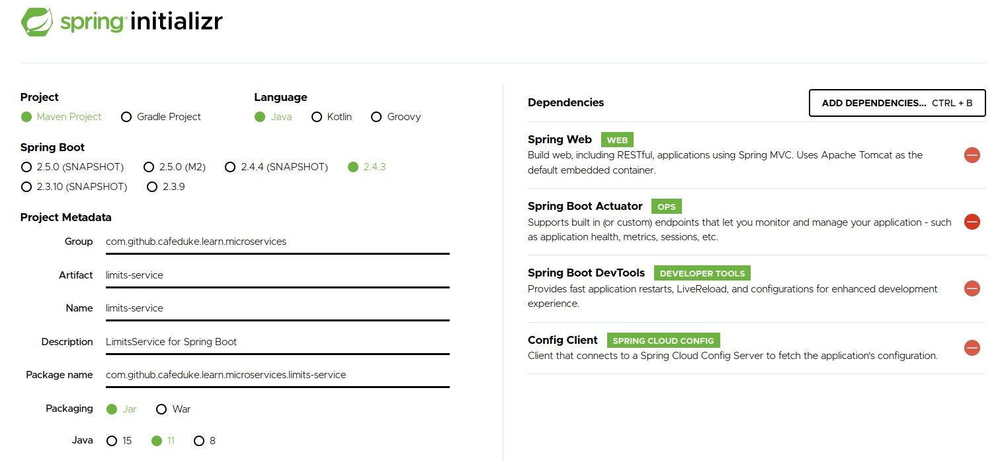
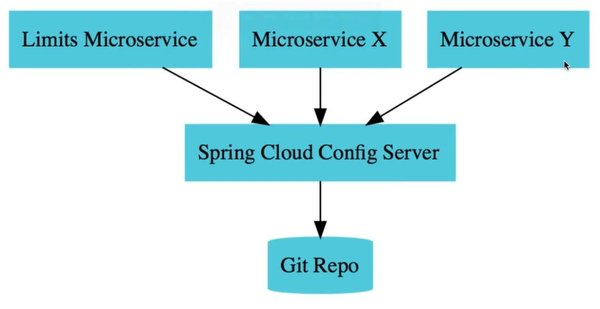
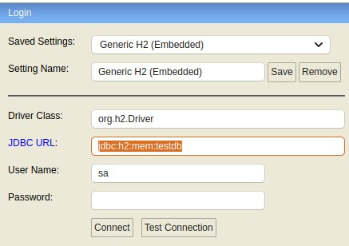
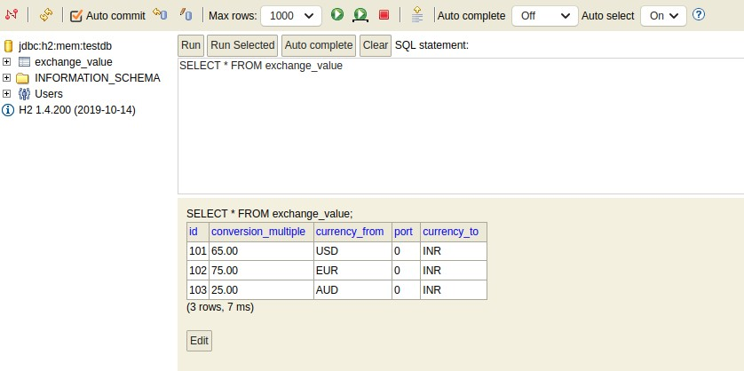
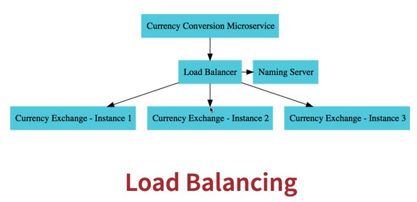
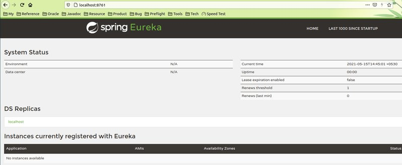

# Introduction

The document details creating a sample application to demo spring boot micro-services (MS).  Microservices are modular, atomic, building blocks that can be scaled and distributed as part of a larger system.

## Spring Boot Starter Package

The  [Spring Starter](https://start.spring.io/) provides a wizard to create and download an archive with dependencies.

- Fill in the project package base name as group-id, project name as artifact-id
- Add dependencies
- Generate the project archive and import it as maven project in Eclipse IDE.



# Configuration access by microservice

The below service shall demonstrate 

- Creating profiles (like qa, dev, default) 
- Having different configuration (In this case, properties file) for each profile. The properties file shall have the format `<mircoservice-name>-<profile>.properties`. Therefore, QA shall have a properties file `limits-service-qa.properties`
- Save the properties files in GIT repository
- Create **Spring Cloud Config Server Microservice** -- The microservice shall connect to a config repository like git and fetch configuration
- Create **Limits Microservice** -- Exposes REST services to return a JSON with properties for the configured profile.

## Overview



## Git Repo

Create a GIT repository and add the following files. Commit and push properties to Github.

```bash
# Default profile
> cat limits-service.properties
limits-service.minimum = 1
limits-service.maximum = 1000

# Dev profile -- Note that max is commented
> cat limits-service-dev.properties
limits-service.minimum = 3
# limits-service.maximum = 3000

# QA profile -- Has higher limits needed for testing.
> cat limits-service-qa.properties
limits-service.minimum = 5
limits-service.maximum = 5000
```

## Spring Could Config Server

### Dependencies

Create spring boot project with following dependencies

| Dependency   | Detail                              |
| ------------ | ----------------------------------- |
| ConfigServer | Connect to repositories like git    |
| DevTools     | LiveReload, Config for enhanced dev |

### Application Properties

```properties
# Name of the microservice
spring.application.name=spring-cloud-config-server

# Port to run the current service
server.port=8888

# URI of the github project
spring.cloud.config.server.git.uri=https://github.com/cafeduke/Learn

# Search path to look for config files
spring.cloud.config.server.git.searchPaths=JavaEE/Spring/WebService/L02_Mircoservice/config-repo
```

### Application

```java
package com.github.cafeduke.learn.microservices.sprintcloudconfigserver;

// Note: Add annotation to enable app as configuration server
@EnableConfigServer
@SpringBootApplication
public class SprintCloudConfigServerApplication
{
  public static void main(String[] args)
  {
    SpringApplication.run(SprintCloudConfigServerApplication.class, args);
  }

}

```

### Verify working

```bash
# Verify working of the following URLs
# ------------------------------------

# Default profile
http://localhost:8888/limits-service/default

# QA profile
http://localhost:8888/limits-service/qa

# Dev profile
http://localhost:8888/limits-service/dev
```

## Limits Service

### Dependencies

| Dependency     | Detail                                       |
| -------------- | -------------------------------------------- |
| Spring Web     | Build restful application using Spring MVC   |
| Config Client  | Client to connect to SpringCloudConfigServer |
| DevTools       | LiveReload, Config for enhanced dev          |
| SpringActuator | Monitor and manage applications              |

### Application Properties

```properties
spring.application.name=limits-service
server.port=8080

# The config profile to be used
spring.profiles.active=qa

# The config server URI
spring.config.import=optional:configserver:http://localhost:8888

# Ensure the properties obtained from confingserver (above) overrides the below properties
limits-service.minimum=11
limits-service.maximum=1111
```

### Controller

```java
package com.github.cafeduke.learn.microservices.limitsservice;

/**
 * The controller simply returns the LimitsConfigBean
 */
@RestController
public class LimitsConfigController
{
  @Autowired
  private LimitsConfigBean config;

  @GetMapping("/limits")
  public LimitsConfigBean getLimitsConfig()
  {
    return config;
  }
}

```

### Configuration Bean

- The `LimitsConfigBean` is a component annotated with `@Component`
- The `@ConfigurationProperties` annotation tells the name of the properties file to look for.

```java
package com.github.cafeduke.learn.microservices.limitsservice;

@Component
@ConfigurationProperties("limits-service")
public class LimitsConfigBean
{
  private int minimum = 0;

  private int maximum = 0;

  protected LimitsConfigBean()
  {

  }
  
	/* Getters and Setters*/
  ...
  ...  
}

```

# Talking Microservices

Create two mircroservies `CurrenceExchangeService` and `CurrencyCalculationService`. 

- The `CurrencyExchangeService` provides the conversion rate from one currency to another. 
  - The REST URI shall be `http://<host:port>/currency-exchange-service/from/<currency>/to/<currency>`
  - Example: `http://localhost:8888/currency-exchange-service/from/USD/to/INR` shall provide the conversion multiple for `USD to INR`
- The `CurrencyCalculationService` calculates the quantity of the `to` currency for a given quantity of the `from`  currency. 
  - The REST URI shall be `http://<host:port>/currency-exchange-service/from/<currency>/to/<currency>/quantity/<quantity>`
  - Example: `http://localhost:8888/currency-exchange-service/from/USD/to/INR/50`  shall provide the value in `INR` for `50 USD`

## Currency Exchange Service

### Dependencies

| Dependency     | Detail                                       |
| -------------- | -------------------------------------------- |
| Spring Web     | Build restful application using Spring MVC   |
| Config Client  | Client to connect to SpringCloudConfigServer |
| DevTools       | LiveReload, Config for enhanced dev          |
| SpringActuator | Monitor and manage applications              |
| Database       | In-memory database -- h2                     |

### SQL file to populate data

```sql
insert into exchange_value (id,currency_from,currency_to,conversion_multiple,port) values (101, 'USD', 'INR', 65, 0);
insert into exchange_value (id,currency_from,currency_to,conversion_multiple,port) values (102, 'EUR', 'INR', 75, 0);
insert into exchange_value (id,currency_from,currency_to,conversion_multiple,port) values (103, 'AUD', 'INR', 25, 0);
```

### Application Properties

```properties
spring.application.name=currency-exchange-service
server.port=8000

# Database properties
# -------------------

# JDBC url
spring.datasource.url=jdbc:h2:mem:testdb;DB_CLOSE_DELAY=-1;DATABASE_TO_UPPER=false

# Show sql statements on console log
spring.jpa.show-sql=true

# Provide a UI console for DB
spring.h2.console.enabled=true
```

### Database Console

- Login to http://localhost:8000/h2-console

- Access the console and verify DB table with data



### Controller

```java
@RestController
public class CurrencyExchangeController
{
  /**
   * Multiple instances of currency exchange controller shall be running.
   * The server port shall be fetched from the env to identify the specific instance that is being used
   */
  @Autowired
  private Environment env;

  @Autowired
  private ExchangeValueService exchangeValueService;

  @GetMapping("/currency-exchange/from/{from}/to/{to}")
  public ExchangeValue getExchangeValue(@PathVariable String from, @PathVariable String to)
  {
    ExchangeValue exchangeValue = exchangeValueService.findByFromAndTo(from, to);
    Optional.ofNullable(exchangeValue).orElseThrow(() -> new RuntimeException("No conversion exists for given currencies. from=" + from + " to=" + to));
    exchangeValue.setEnv("ServerPort=" + Integer.valueOf(env.getProperty("local.server.port")));
    return exchangeValue;
  }
}
```

### Service

```java
public interface ExchangeValueService extends JpaRepository<ExchangeValue, Long>
{
  /**
   * Just by adding the interface definition, JPA shall provide the implementation!
   * 
   * @param from The 'from' currency field
   * @param to The 'to' currency field
   * @return The ExchangeValue entity object.
   */
  ExchangeValue findByFromAndTo(String from, String to);
}
```

### Entity Bean

```java
package com.github.cafeduke.learn.microservices.currencyexchangeservice;

import java.math.BigDecimal;

import javax.persistence.Column;
import javax.persistence.Entity;
import javax.persistence.Id;

@Entity
public class ExchangeValue
{
  @Id
  private Long id;

  /**
   * We cannot have an SQL column name as 'from' as it is an SQL keyword.
   */
  @Column(name = "currency_from")
  private String from;

  @Column(name = "currency_to")
  private String to;

  @Column(name = "conversion_multiple")
  private BigDecimal conversionMultiple;

  /**
   * This is not mapped to database
   * The environment details must indicate the server sending the response.
   */
  private String env;

  protected ExchangeValue()
  {

  }

  protected ExchangeValue(Long id, String from, String to, BigDecimal conversionMultiple)
  {
    super();
    this.id = id;
    this.from = from;
    this.to = to;
    this.conversionMultiple = conversionMultiple;
  }
  /* Getters and Setters */
}

```

### REST Request

```bash
json-get http://localhost:8000/currency-exchange/from/USD/to/INR             
Status: HTTP/1.1 200
Content-Type: application/json
Transfer-Encoding: chunked

{
  "id": 101,
  "from": "USD",
  "to": "INR",
  "conversionMultiple": 65,
  "env": "ServerPort=8000"
}
```


## Currency Calculation Service

### Dependencies

| Dependency     | Detail                                       |
| -------------- | -------------------------------------------- |
| Spring Web     | Build restful application using Spring MVC   |
| Config Client  | Client to connect to SpringCloudConfigServer |
| DevTools       | LiveReload, Config for enhanced dev          |
| SpringActuator | Monitor and manage applications              |
| Database       | In-memory database -- h2                     |

### Application Properties

```properties
spring.application.name=currency-calculation-service
server.port=8100

# The config server URI
spring.config.import=optional:configserver:http://localhost:8888
```

### Controller

```java
@RestController
public class CurrencyCalculationServiceController
{
  @GetMapping("/currency-calculator/from/{from}/to/{to}/quantity/{quantity}")
  public CurrencyCalculationBean getCalculation(@PathVariable String from, @PathVariable String to, @PathVariable BigDecimal quantity)
  {
    // A map of URI parameter to its value
    Map<String, String> mapParamValue = Map.ofEntries(Map.entry("from", from), Map.entry("to", to));

    /*
     * The URL to the service that is requested is hard-coded.
     * The JSON obtained by URL, passed to getForEntity, is mapped to bean 'CurrencyCalculationBean' (Ensure the JSON response and field names in bean are identical)
     */
    ResponseEntity<CurrencyCalculationBean> responseEntity = new RestTemplate()
      .getForEntity("http://localhost:8000/currency-exchange/from/{from}/to/{to}", CurrencyCalculationBean.class, mapParamValue);
    CurrencyCalculationBean currencyCalculationBean = responseEntity.getBody();
    currencyCalculationBean.setQuantity(quantity);
    currencyCalculationBean.doCalulate();
    return currencyCalculationBean;
  }
}
```

### Java Bean

```java
public class CurrencyCalculationBean
{
  private Long id;
  private String from;
  private String to;
  private BigDecimal conversionMultiple = BigDecimal.ONE;
  private BigDecimal quantity = BigDecimal.ONE;
  private BigDecimal totalCalculatedAmount = BigDecimal.ONE;
  private String env;

  public Long getId()
  {
    return id;
  }

  public CurrencyCalculationBean()
  {

  }

  public CurrencyCalculationBean(Long id, String from, String to, BigDecimal conversionMultiple, BigDecimal quantity, BigDecimal totalCalculatedAmount, String env)
  {
    super();
    this.id = id;
    this.from = from;
    this.to = to;
    this.conversionMultiple = conversionMultiple;
    this.quantity = quantity;
    this.totalCalculatedAmount = totalCalculatedAmount;
    this.setEnv(env);
  }

  public void doCalulate()
  {
    totalCalculatedAmount = quantity.multiply(conversionMultiple);
  }
	
  /* Getters and Setters*/
}
```

### REST Request

```bash
> json-get http://localhost:8100/currency-calculator/from/USD/to/INR/quantity/3
Status: HTTP/1.1 200
Content-Type: application/json
Transfer-Encoding: chunked

{
  "id": 101,
  "from": "USD",
  "to": "INR",
  "conversionMultiple": 65,
  "quantity": 3,
  "totalCalculatedAmount": 195,
  "env": "ServerPort=8000"
}
```


# Talking Microservices via Feign

In the previous section, we had to hard-code the URL of the target mircoservice and also write a lot of code to make micro services talk to each other. Spring cloud provides Feign (pronounced fay-in) 

## Currency Calculation Service

### Dependencies

```xml
<dependency>
  <groupId>org.springframework.cloud</groupId>
  <artifactId>spring-cloud-starter-openfeign</artifactId>
</dependency> 
```


```java
/**
 * Feign is used by a microservice to talk to other microservices.
 * We need to
 * - Update pom.xml to include artifact 'spring-cloud-starter-openfeign'
 * - Add the '@EnableFeignClients' annotation to the application.
 */
@SpringBootApplication
@EnableFeignClients
public class CurrencyCalculationServiceApplication
{
  public static void main(String[] args)
  {
    SpringApplication.run(CurrencyCalculationServiceApplication.class, args);
  }
}
```

### Feign Client Proxy

```java
/**
 * The FeignClient name is typically the application name (See spring.application.name in application.properties) of the target service.
 *
 */
@FeignClient(name = "currency-exchange-service", url = "localhost:8000")
public interface CurrencyExchangeServiceProxy
{
  /**
   * This method of the proxy
   * - Needs to invoke the currency-exchange microservice passing the 'from' and 'to'
   * - The resultant JSON needs to be mapped to CurrencyCalcuationBean
   * 
   * @param from
   * @param to
   * @return
   */
  @GetMapping("/currency-exchange/from/{from}/to/{to}")
  public CurrencyCalculationBean getExchangeValue(@PathVariable String from, @PathVariable String to);

}
```

### Controller

```java
@RestController
public class CurrencyCalculationServiceController
{
  @Autowired
  private CurrencyExchangeServiceProxy proxy;

  @GetMapping("/currency-calculator/from/{from}/to/{to}/quantity/{quantity}")
  public CurrencyCalculationBean getCalculation(@PathVariable String from, @PathVariable String to, @PathVariable BigDecimal quantity)
  {
    CurrencyCalculationBean currCalculationBean = proxy.getExchangeValue(from, to);
    currCalculationBean.setQuantity(quantity);
    currCalculationBean.doCalulate();
    return currCalculationBean;
  }

  @GetMapping("/currency-calculator-legacy/from/{from}/to/{to}/quantity/{quantity}")
  public CurrencyCalculationBean getCalculationLegacy(@PathVariable String from, @PathVariable String to, @PathVariable BigDecimal quantity)
  {
    // A map of URI parameter to its value
    Map<String, String> mapParamValue = Map.ofEntries(Map.entry("from", from), Map.entry("to", to));
		...
  }
}
```

### REST Request

```bash
json-get http://localhost:8100/currency-calculator/from/USD/to/INR/quantity/5 
Status: HTTP/1.1 200
Content-Type: application/json
Transfer-Encoding: chunked

{
  "id": 101,
  "from": "USD",
  "to": "INR",
  "conversionMultiple": 65,
  "quantity": 5,
  "totalCalculatedAmount": 325,
  "env": "ServerPort=8000"
}

> json-get http://localhost:8100/currency-calculator-legacy/from/USD/to/INR/quantity/5
Status: HTTP/1.1 200
Content-Type: application/json
Transfer-Encoding: chunked

{
  "id": 101,
  "from": "USD",
  "to": "INR",
  "conversionMultiple": 65,
  "quantity": 5,
  "totalCalculatedAmount": 325,
  "env": "ServerPort=8000"
}
```


# Naming service

Instead of hardcoding URLs the microservices will be registered with the naming server (service registry). 



In the above example:

- All services are registered with the naming server.
- Multiple instances of CurrencyExchangeService are being load-balanced using an LB.
- The CurrencyCalculationService shall query the naming server for the URL of the CurrencyExchangeService.
- The naming server shall return the URL to the load-balancer.
- The CurrencyCalculationServer shall request the corresponding LB URL which shall reach one of the CurrencyExchangeService instance.


## Naming service server

### Dependencies

| Dependency     | Detail                                       |
| -------------- | -------------------------------------------- |
| Config Client  | Client to connect to SpringCloudConfigServer |
| DevTools       | LiveReload, Config for enhanced dev          |
| SpringActuator | Monitor and manage applications              |
| Eureka Server  | Naming server                                |

```java
@EnableEurekaServer
@SpringBootApplication
public class NamingServerApplication
{
  public static void main(String[] args)
  {
    SpringApplication.run(NamingServerApplication.class, args);
  }
}
```

### ApplicationProperties

```properties
spring.application.name=naming-server
server.port=8761

# Do not register this client withe eureka
eureka.client.register-with-eureka=false

# Do not fetch eureka registry information from eureka server
eureka.client.fetch-registry=false
```

### Eureka Dashboard

We can launch the appliation to see that no instances are currently registered with Eureka naming server.




## Registering with naming server

A microservice can register itself with the naming server by configuring Eureka client.

### Dependencies

Update the pom.xml of the corresponding miroservices (CurrencyCalculationService and CurrencyExchangeService) to include eureka-client

```xml
<!-- EurekaClient: client to connect to naming server -->
<dependency>
  <groupId>org.springframework.cloud</groupId>
  <artifactId>spring-cloud-starter-netflix-eureka-client</artifactId>
</dependency>
```

### Application Properties

Update the application properties of microservices. Config the client to point to the naming server URL.

#### Currency Calculation Service

```properties
spring.application.name=currency-calculation-service
server.port=8100

# The config server URI
spring.config.import=optional:configserver:http://localhost:8888

# NamingServer properties
# -----------------------
# Eureka client dependency is added in the microservice to talk to naming server
eureka.client.serviceUrl.defaultZone=http://localhost:8761/eureka

```

#### Currency Exchange Service

```properties
spring.application.name=currency-exchange-service
server.port=8000

# Database properties
# -------------------
# JDBC url
spring.datasource.url=jdbc:h2:mem:testdb;DB_CLOSE_DELAY=-1;DATABASE_TO_UPPER=false

# Show sql statements on console log
spring.jpa.show-sql=true

# Provide a UI console for DB
spring.h2.console.enabled=true

# NamingServer properties
# -----------------------
# Eureka client dependency is added in the microservice to talk to naming server
eureka.client.serviceUrl.defaultZone=http://localhost:8761/eureka
```

### Eureka Dashboard

Restart naming server followed by mircroservices (CurrencyExchange and CurrencyCalculation) Open the eureka dashboard at http://localhost:8761/ to verify that services are registered.

| Application                      | AMIs        | Availability Zones | Status                                                       |
| -------------------------------- | ----------- | ------------------ | ------------------------------------------------------------ |
| **CURRENCY-CALCULATION-SERVICE** | **n/a** (1) | (1)                | [192.168.0.105:currency-calculation-service:8100](http://192.168.0.105:8100/actuator/info) |
| **CURRENCY-EXCHANGE-SERVICE**    | **n/a** (2) | (2)                | [192.168.0.105:currency-exchange-service:8000](http://192.168.0.105:8000/actuator/info) |

# Load balancing services

## Start multiple instances of services

Lets start multiple instances of CurrencyExchangeService (Say, CurrencyExchangeServiceApplicationA and CurrencyExchangeServiceApplicationB)

This can be done using eclipse as follows

- Navigate to (Run > RunConfigurations)
- Click on 'Duplicate the launch configuration' (copy) button
- Provide a name like CurrencyExchangeServiceApplicationB
- Add `-Dserver.port=8001` to VM Arguments

## Verify registration with naming server

Open the eureka dashboard at http://localhost:8761/  and verify registration of both instances of CurrencyExchangeService and CurrencyCalculationService

| Application                      | AMIs        | Availability Zones | Status                                                       |
| -------------------------------- | ----------- | ------------------ | ------------------------------------------------------------ |
| **CURRENCY-CALCULATION-SERVICE** | **n/a** (1) | (1)                | [192.168.0.105:currency-calculation-service:8100](http://192.168.0.105:8100/actuator/info) |
| **CURRENCY-EXCHANGE-SERVICE**    | **n/a** (2) | (2)                | [192.168.0.105:currency-exchange-service:8000](http://192.168.0.105:8000/actuator/info) <br />[192.168.0.105:currency-exchange-service:8001](http://192.168.0.105:8001/actuator/info) |

## Configure LB via Feign

Earlier (Before having naming server),

- In `CurrencyCalculationService`, class `CurrencyExchangeServiceProxy` (Uses `@FeignClient`) abstracted talks to `CurrencyExchangeService`
- The `@FeignClient` annotation mentioned the **name** of service and the **URL** to be used. 
- The CurrencyExchangeServiceProxy used the URL (in `@FeignClient` annotation) to connect to the target service.

Now,

- `CurrencyCalculationService` and `CurrencyExchangeService` instances are registered with the Eureka naming server
- The `@FeignClient` annotation **just** mentions the **name** of the service alone.
- The `CurrencyExchangeServiceProxy` fetches the URL of the target service from the naming server.

```java
package com.github.cafeduke.learn.microservices.currencycalculationservice;

/**
 * The FeignClient name is typically the application name (See spring.application.name in application.properties) of the target service.
 *
 */
// @FeignClient(name = "currency-exchange-service", url = "localhost:8000")
@FeignClient(name = "currency-exchange-service")
public interface CurrencyExchangeServiceProxy
{
  /**
   * This method of the proxy
   * - Needs to invoke the currency-exchange microservice passing the 'from' and 'to'
   * - The resultant JSON needs to be mapped to CurrencyCalcuationBean
   * 
   * @param from
   * @param to
   * @return
   */
  @GetMapping("/currency-exchange/from/{from}/to/{to}")
  public CurrencyCalculationBean getExchangeValue(@PathVariable String from, @PathVariable String to);

}
```

## Verify LB

Note that the port of the server servicing the request changes using round-robin algorithm.

```bash
> json-get http://localhost:8100/currency-calculator/from/USD/to/INR/quantity/3
Status: HTTP/1.1 200
Content-Type: application/json
Transfer-Encoding: chunked

{
  "id": 101,
  "from": "USD",
  "to": "INR",
  "conversionMultiple": 65,
  "quantity": 3,
  "totalCalculatedAmount": 195,
  "env": "ServerPort=8000"
}

> json-get http://localhost:8100/currency-calculator/from/USD/to/INR/quantity/3
Status: HTTP/1.1 200
Content-Type: application/json
Transfer-Encoding: chunked

{
  "id": 101,
  "from": "USD",
  "to": "INR",
  "conversionMultiple": 65,
  "quantity": 3,
  "totalCalculatedAmount": 195,
  "env": "ServerPort=8001"
}
```

# API Gateway

A production deployment shall consist of thousands of micro-services. These micro-services have a lot of **common features** like 

- Authorisation
- Authentication
- Logging
- Rate Limiting

Where do we implement all these features? The typical solution is an **API Gateway** -- In spring cloud the gateway used is "Spring Cloud Gateway"

## Gateway Service

### Dependencies

| Dependency              | Detail                                                       |
| ----------------------- | ------------------------------------------------------------ |
| Config Client           | Client to connect to SpringCloudConfigServer                 |
| DevTools                | LiveReload, Config for enhanced dev                          |
| SpringActuator          | Monitor and manage applications                              |
| Eureka Discovery Client | Client to connect to naming server                           |
| Gateway                 | Route to APIs and provide cross cutting concerns to them such as security, monitoring/metrics, and resiliency. |

### Application Properties

```properties
spring.application.name=api-gateway
server.port=8765

# API Gateway
# -----------
spring.cloud.gateway.discovery.locator.enabled=true
spring.cloud.gateway.discovery.locator.lower-case-service-id=true

# Config Client: Connect to config server
# ---------------------------------------
spring.config.import=optional:configserver:http://localhost:8888

# Naming Client: Connect to naming server
# ---------------------------------------
# Eureka client dependency is added in the microservice to talk to naming server
eureka.client.serviceUrl.defaultZone=http://localhost:8761/eureka

```

### Verify registration with naming server

| Application                      | AMIs        | Availability Zones | Status                                                       |
| -------------------------------- | ----------- | ------------------ | ------------------------------------------------------------ |
| **API-GATEWAY**                  | **n/a** (1) | (1)                | [192.168.0.107:api-gateway:8765](http://192.168.0.107:8765/actuator/info) |
| **CURRENCY-CALCULATION-SERVICE** | **n/a** (1) | (1)                | [192.168.0.107:currency-calculation-service:8100](http://192.168.0.107:8100/actuator/info) |
| **CURRENCY-EXCHANGE-SERVICE**    | **n/a** (2) | (2)                | [192.168.0.107:currency-exchange-service:8000](http://192.168.0.107:8000/actuator/info) <br />[192.168.0.107:currency-exchange-service:8001](http://192.168.0.107:8001/actuator/info) |

### Verify access via Gateway

The client shall send request via the gateway (localhost:8765 in this case) which shall in-turn route request to corresponding mircoservice. 

The common features can be now implemented as part of the gateway. For example, we could have **authentication enabled for certain URLs** in the API gateway

```bash
# CURRENCY-CALCULATION-SERVICE (to lower-case) is the name as registered with Eureka
json-get http://localhost:8765/currency-calculation-service/currency-calculator/from/USD/to/INR/quantity/3
Status: HTTP/1.1 200 OK
Content-Type: application/json
transfer-encoding: chunked

{
  "id": 101,
  "from": "USD",
  "to": "INR",
  "conversionMultiple": 65,
  "quantity": 3,
  "totalCalculatedAmount": 195,
  "env": "ServerPort=8001"
}
```

## Routes

### Simple Redirection

When the browser sends a request to "/get" of the APIGateway, it shall be routed to `http://httpbin.org`. The resultant request shall be `http://httpbin.org:80/get`

```java
package com.github.cafeduke.learn.microservices.apigateway;

@Configuration
public class APIGatewayConfiguration
{
  @Bean
  public RouteLocator gatewayRouter(RouteLocatorBuilder builder)
  {
    return builder.routes()
      .route(p -> p.path("/get").uri("http://httpbin.org:80"))
      .build();
  }
}
```

### Filters

When the browser sends a request to `/get` of the APIGateway, it shall add custom headers, query parameters and then route it to `http://httpbin.org:80`. The resultant request shall be  `http://httpbin.org:80/get?name=Raghu` (with header `MyName: Raghu`)

```java
@Configuration
public class APIGatewayConfiguration
{
  @Bean
  public RouteLocator gatewayRouter(RouteLocatorBuilder builder)
  {
    return builder.routes()
      .route(p -> p.path("/get")
        .filters(f -> f.addRequestHeader("MyName", "Raghu").addRequestParameter("name", "Raghu"))
        .uri("http://httpbin.org:80"))
      .build();
  }
}
```

```bash
> json-get "http://localhost:8765/get"
Status: HTTP/1.1 200 OK
Access-Control-Allow-Credentials: true
Access-Control-Allow-Origin: *
content-length: 590
Content-Type: application/json

{
  "args": {
    "name": "Raghu"
  },
  "headers": {
    "Accept": "text/html, image/gif, image/jpeg, *; q=.2, */*; q=.2",
    "Content-Length": "0",
    "Forwarded": "proto=http;host=\"localhost:8765\";for=\"127.0.0.1:58390\"",
    "Host": "httpbin.org",
    "Myname": "Raghu",
    "Otdclientid": "9b63fdd1-e8b6-4a23-aa3e-8a70433ad019",
    "User-Agent": "Java/1.8.0_261",
    "X-Amzn-Trace-Id": "Root=1-60a915c0-54c6fee834199ccc5973026e",
    "X-Forwarded-Host": "localhost:8765"
  },
  "origin": "127.0.0.1, 124.123.81.169",
  "url": "http://localhost:8765/get?name=Raghu"
}
```
### Filters to rewrite URI

The URI `/snoop` was rewritten as `/DukeApp/Snoop.jsp`. The request to API Gateway host was sent to `localhost:18801` (Tomcat is running here with DukeApp deployed)

```java
@Configuration
public class APIGatewayConfiguration
{
  @Bean
  public RouteLocator gatewayRouter(RouteLocatorBuilder builder)
  {
    return builder.routes()
      .route(p -> p.path("/get")
        .filters(f -> f.addRequestHeader("MyClientId", "Raghu").addRequestParameter("name", "Raghu"))
        .uri("http://httpbin.org"))
      .route(p -> p.path("/snoop")
        .filters(f -> f.rewritePath("/snoop", "/DukeApp/Snoop.jsp").addRequestHeader("MyClientId", "Raghu").addRequestParameter("name", "Raghu"))
        .uri("http://localhost:18801"))
      .build();
  }
}
```

Verify request/response

```bash
> jget -u http://localhost:8765/snoop
# -----------------------------------------------
# Method
# -----------------------------------------------
Method=GET
ClientIP=127.0.0.1
RequestURL=http://MS1:18801/DukeApp/Snoop.jsp
IsSecure=HTTP
ServerName=null

# -----------------------------------------------
# Request Headers
# -----------------------------------------------

accept=text/html, image/gif, image/jpeg, *; q=.2, */*; q=.2
otdclientid=e2eb448a-c55e-4db2-933a-47922ed4429c
user-agent=Java/1.8.0_261
myclientid=Raghu
forwarded=proto=http;host="localhost:8765";for="127.0.0.1:58598"
x-forwarded-for=127.0.0.1
x-forwarded-proto=http
x-forwarded-port=8765
x-forwarded-host=localhost:8765
host=localhost:18801
content-length=0

# -----------------------------------------------
# Parameters
# -----------------------------------------------
name=Raghu
```


### Simplify URI to services

```java
package com.github.cafeduke.learn.microservices.apigateway;

@Configuration
public class APIGatewayConfiguration
{
  @Bean
  public RouteLocator gatewayRouter(RouteLocatorBuilder builder)
  {
    return builder.routes()
      .route(p -> p.path("/get")
        .filters(f -> f.addRequestHeader("MyName", "Raghu").addRequestParameter("name", "Raghu"))
        .uri("http://httpbin.org"))
      .route(p -> p.path("/currency-calculator/**")
        .uri("lb://currency-calculation-service"))
      .route(p -> p.path("/currency-exchange/**")
        .uri("lb://currency-exchange-service"))
      .build();
  }
}
```

Verify request/response via API Gateway

```bash
> json-get http://localhost:8765/currency-calculator/from/USD/to/INR/quantity/3
Status: HTTP/1.1 200 OK
Content-Type: application/json
transfer-encoding: chunked

{
  "id": 101,
  "from": "USD",
  "to": "INR",
  "conversionMultiple": 65,
  "quantity": 3,
  "totalCalculatedAmount": 195,
  "env": "ServerPort=8001"
}

> json-get http://localhost:8765/currency-exchange/from/USD/to/INR
Status: HTTP/1.1 200 OK
Content-Type: application/json
transfer-encoding: chunked

{
  "id": 101,
  "from": "USD",
  "to": "INR",
  "conversionMultiple": 65,
  "env": "ServerPort=8001"
}

```

# Resilience4J

Microservices could be wired in such a way that there is a chain of dependent mircoservices as shown below.

```
MS1 ---> MS2 --> MS3 ---> MS4 ---> MS5
```

Here, say `MS3` has become slow or unreliable. This will affect the entire chain. Circuit breaker provides several ways to work around such issues. For example, in this case

- `MS2` can be configured to retry for `n` attempts, for certain requests, before returning failure response.
- `MS2` can be configured to return a default response for certain requests, after 'n' failed attempts.

## Retry with fallback

Following is configured for `CurrencyExchangeService`

### Dependencies

```xml
<!-- Circuit Breaker -->
<dependency>
  <groupId>org.springframework.boot</groupId>
  <artifactId>spring-boot-starter-aop</artifactId>
</dependency>

<dependency>
  <groupId>io.github.resilience4j</groupId>
  <artifactId>resilience4j-spring-boot2</artifactId>
</dependency>
```

### Controller

```java
package com.github.cafeduke.learn.microservices.currencyexchangeservice;

@RestController
public class CircuitBreakerController
{
  private Logger logger = Logger.getLogger(getClass().getName());

  @GetMapping("/test-retry")
  @Retry(name = "test-retry", fallbackMethod = "fallbackResponse")
  public String testRetry()
  {
    logger.info("Inside testRetry");
    ResponseEntity<String> entityNotFound = new RestTemplate().getForEntity("http://localhost:8080/doesNotExist", String.class);
    return entityNotFound.getBody();
  }

  /**
   * This method shall be invoked if maximum retry attempts fail
   */
  public String fallbackResponse(Throwable t)
  {
    return "Hey, server is busy. Eat an apple and be back.";
  }
}
```

### Application Properties

```properties
spring.application.name=currency-exchange-service
server.port=8000
...
...

# Resilience4j: Retry
# -------------------
# Number of retry attempts for service by name 'test-retry'
resilience4j.retry.instances.test-retry.max-attempts=3

# Time to wait before the next retry
resilience4j.retry.instances.test-retry.wait-duration=2s

# The next retry attempt will not be after a linear interval (like 2s wait-duration as configured above) but 
# shall exponentially increase using the wait-duration as a parameter. For example, it could be 2, 4, 8 and so on.
resilience4j.retry.instances.test-retry.enable-exponential-backoff=true
```

## Circuit Breaker

### Dependencies

```xml
<!-- Circuit Breaker -->
<dependency>
  <groupId>org.springframework.boot</groupId>
  <artifactId>spring-boot-starter-aop</artifactId>
</dependency>

<dependency>
  <groupId>io.github.resilience4j</groupId>
  <artifactId>resilience4j-spring-boot2</artifactId>
</dependency>
```

### Controller

```java
package com.github.cafeduke.learn.microservices.currencyexchangeservice;

@RestController
public class CircuitBreakerController
{
  private Logger logger = Logger.getLogger(getClass().getName());

  @GetMapping("/test-retry")
  @Retry(name = "test-retry", fallbackMethod = "fallbackResponse")
  public String testRetry()
  {
    logger.info("Inside testRetry");
    ResponseEntity<String> entityNotFound = new RestTemplate().getForEntity("http://localhost:8080/doesNotExist", String.class);
    return entityNotFound.getBody();
  }

  @GetMapping("/test-circuit-breaker")
  @CircuitBreaker(name = "test-circuit-breaker", fallbackMethod = "fallbackResponse")
  public String testCircuitBreaker()
  {
    logger.info("Inside testCircuitBreaker");
    ResponseEntity<String> entityNotFound = new RestTemplate().getForEntity("http://localhost:8080/doesNotExist", String.class);
    return entityNotFound.getBody();
  }

  /**
   * This method shall be invoked if maximum retry attempts fail
   */
  public String fallbackResponse(Throwable t)
  {
    return "Hey, server is busy. Eat an apple and be back.";
  }
}
```

### Working of Circuit Breaker

Lets say we send multiple requests to  `/test-circuit-breaker`  using the command `watch -n 0.1 http://localhost:8000/test-circuit-breaker`. The watch command sends a request every 100ms, or 10 requests/second.

- After continuous failures reach a point, the request is no more sent to `testCircuitBreaker` method, the fall back response directly is sent.
- This raises the question, how will the circuit breaker know if the `testCircuitBreaker` is back on track? The below state diagram explains this.

> A circuit breaker prevents a microservice from getting bombarded with more requests when it is already loaded. 
> However, it is also smart enough to switch back when the service is back on track.


| State     | Detail                                                       |
| --------- | ------------------------------------------------------------ |
| CLOSED    | Circuit is connected. The requests are sent to target service. |
| OPEN      | Circuit is broken. None of the requests are sent to target service. All of them are sent fallback response. |
| HALF_OPEN | A configured percentage of requests are sent to target service, others are sent fallback response. |

- The circuit starts by being in CLOSED state and requests are sent to target service.
- Once the failure rate crosses threshold, the circuit switches to OPEN state.
- Once in the OPEN state, it remains in the state for a wait-duration during which all requests receive fallback response.
- After the wait-duration is over, the circuit switches to HALF_OPEN state.
- In the HALF_OPEN state, a configured number of requests shall be sent to target service, others will receive fallback response
  - If threshold requests sent to target service succeed, the circuit shall switch to CLOSED state
  - If threshold requests sent to target service fail, the circuit shall switch to OPEN state


## Rate Limiter

Limit the number of requests a service can be loaded within a given time interval (Eg: 10 requests per second, 3 requests in 10 seconds). Requests exceeding the limit shall be rejected.

### Controller

```java
package com.github.cafeduke.learn.microservices.currencyexchangeservice;

@RestController
public class CircuitBreakerController
{
  private Logger logger = Logger.getLogger(getClass().getName());

	...
  ...
    
  @GetMapping("/test-rate-limiter")
  @RateLimiter(name = "test-rate-limiter")
  public String testRateLimiter()
  {
    return "Hello from rate limiter";
  }

  /**
   * This method shall be invoked if maximum retry attempts fail
   */
  public String fallbackResponse(Throwable t)
  {
    return "Hey, server is busy. Eat an apple and be back.";
  }
}

```

### Application Properties

```properties
# Resilience4j: Rate Limiter
# --------------------------

# Here, only limit-for-period requests shall be allowed every limit-refresh-period seconds.
# That is, if limit-for-period=2 and limit-refresh-period=1s then the rate allowed is 2 request/second
resilience4j.ratelimiter.instances.test-rate-limiter.limit-for-period=2
resilience4j.ratelimiter.instances.test-rate-limiter.limit-refresh-period=10s
```

## Bulkhead

Limit the number of concurrent calls to a service.

### Controller

```java
package com.github.cafeduke.learn.microservices.currencyexchangeservice;

@RestController
public class CircuitBreakerController
{
  private Logger logger = Logger.getLogger(getClass().getName());
  
  @GetMapping("/test-bulk-head")
  @Bulkhead(name = "test-bulk-head")
  public String testBulkHead()
  {
    return "Hello from bulk head";
  }
}  
```

### Application Properties

```properties
# Resilience4j: Bulkhead
# ----------------------
# Only allow a maximum of 10 concurrent calls
resilience4j.bulkhead.instances.test-bulk-head.max-concurrent-calls=10
```


