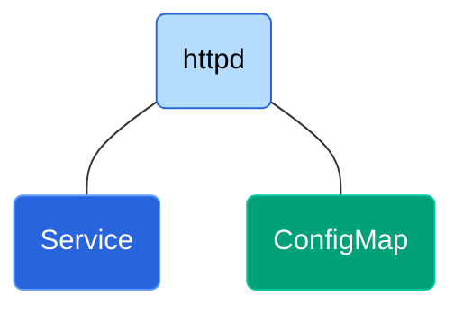

# Introduction

This document provides the basic K8s setup using `httpd`  (Apache HTTP Server) container. The setup is used to understand the following concepts

- Deployment, replicas, pods and service
- Accessing via Node IP, internal Service IP and Pod IP
- Assert service load balancing, self healing of pods, scaling of pods
- Assert Service IP and ConfigMap persistance
- Test out-of-box Zero downtime when pod is deleted during load

# Configuration




`Deployment` creates replicas of pods containing stateless container `httpd`. 

```yaml
apiVersion: apps/v1
kind: Deployment
metadata:
  name: httpd
  labels:
    app: httpd
spec:
  replicas: 2
  selector:
    matchLabels:
      app: httpd
  template:
    metadata:
      labels:
        app: httpd
    spec:
      containers:
        - name: httpd
          image: httpd:2.4
          ports:
            - containerPort: 80
```

Run K8s commands to create `ConfigMap` components from files on local machine

```bash
minikube kubectl -- create configmap htdocs-configmap --from-file=htdocs  -o yaml --dry-run=client "|" minikube kubectl -- apply -f -
minikube kubectl -- create configmap cgibin-configmap --from-file=cgi-bin -o yaml --dry-run=client "|" minikube kubectl -- apply -f -
minikube kubectl -- create configmap conf-configmap   --from-file=conf    -o yaml --dry-run=client "|" minikube kubectl -- apply -f -
```

Volumes are created using the `ConfigMap` and attached to pods.

```yaml
spec:
  ...
  ...
  # Template for pod
  template:    
    spec:
      # Container spec	
      containers:
        ...
        ...
      # Volumes defined for pods
      volumes:
        - name: htdocs-volume
          configMap:
            name: htdocs-configmap
        - name: cgibin-volume
          configMap:
            name: cgibin-configmap
            defaultMode: 0755
        - name: conf-volume
          configMap:
            name: conf-configmap
```

The above created volumes are mounted into the `spec.containers.volumeMounts` . The `mountPath` shall the path where the container looks for the files.

```yaml
# Spec for pod
spec:
  ...
  ...  
  template:
    # Spec for container
    spec:
      containers:
          ...
          ...
          volumeMounts:
            - name: htdocs-volume
              mountPath: /usr/local/apache2/htdocs
            - name: cgibin-volume
              mountPath: /usr/local/apache2/cgi-bin
            - name: conf-volume
              mountPath: /usr/local/apache2/conf
```

An external `LoadBalancer` K8s component is created to the pods 

# Test setup


## Start setup

```bash
> minikube start

> minikube ip
192.168.59.100

> minikube status
minikube
type: Control Plane
host: Running
kubelet: Running
apiserver: Running
kubeconfig: Configured

> cd ~/GitProjects/Learn/K8s/01-basic
> run.sh
configmap/htdocs-configmap configured
deployment.apps/httpd unchanged
service/httpd-service unchanged	

> kubectl get all
# Pods
# ------------------------------------------------------------------------------------------
NAME                        READY   STATUS    RESTARTS     AGE
pod/httpd-8b6857cfd-pxpv4   1/1     Running   1 (3m ago)   3d15h
pod/httpd-8b6857cfd-s5wjr   1/1     Running   1 (3m ago)   3d15h

# Services
# ------------------------------------------------------------------------------------------
NAME                    TYPE           CLUSTER-IP     EXTERNAL-IP   PORT(S)          AGE
service/httpd-service   LoadBalancer   10.98.172.79   <pending>     8080:30000/TCP   3d15h
service/kubernetes      ClusterIP      10.96.0.1      <none>        443/TCP          3d16h

# Deployments
# ------------------------------------------------------------------------------------------
NAME                    READY   UP-TO-DATE   AVAILABLE   AGE
deployment.apps/httpd   2/2     2            2           3d15h

# ReplicaSets
# ------------------------------------------------------------------------------------------
NAME                               DESIRED   CURRENT   READY   AGE
replicaset.apps/httpd-694dfc759d   0         0         0       3d15h
replicaset.apps/httpd-8b6857cfd    2         2         2       3d15h

```

# Features

## Accessibility

### Service Config

```yaml
apiVersion: v1
kind: Service
metadata:
  name: httpd-service
spec:
  selector:
    app: httpd
  type: LoadBalancer
  ports:
    - protocol: TCP
      port: 8080               # service-listen-port         - Service listen port
      targetPort: 80           # service-origin-server-port  - Service has to forward request to this origin-server (pod) port
      nodePort: 30000          # service-external-port       - Port exposed to serve external requests
```

### Get node, service and Pod IP

- The service IP of `httpd-service` is `10.107.63.76`
- The service is listening for internal requests from the cluster at `8080` and external requests at `30000`
- The service shall load-balance the requests among pods listening at `172.17.0.3:80` and `172.17.0.4:80`

```bash
# Node IP
> minikube ip
192.168.59.100

# Get service IPs
# Note that the httpd-service is accessible within the cluster at 10.107.63.76:8080
# -------------------------------------------------------------------------------------------------
> kubectl get services
NAME            TYPE           CLUSTER-IP     EXTERNAL-IP   PORT(S)          AGE
httpd-service   LoadBalancer   10.107.63.76   <pending>     8080:30000/TCP   16h
kubernetes      ClusterIP      10.96.0.1      <none>        443/TCP          16h
# Get pod IPs
# -------------------------------------------------------------------------------------------------
> kubectl get pods -o wide
NAME                     READY   STATUS    RESTARTS        AGE   IP           NODE       NOMINATED NODE   READINESS GATES
httpd-5b6584489c-kgdkz   1/1     Running   2 (9m25s ago)   16h   172.17.0.4   minikube   <none>           <none>
httpd-5b6584489c-z4nm5   1/1     Running   2 (9m25s ago)   16h   172.17.0.3   minikube   <none>           <none>
```

### Request using Node IP

```bash
> curl -I http://$(minikube ip):30000/hello.html      
HTTP/1.1 200 OK
Date: Mon, 12 Dec 2022 05:20:55 GMT
Server: Apache/2.4.54 (Unix)
Last-Modified: Thu, 08 Dec 2022 14:17:33 GMT
ETag: "37-5ef51b2b4f51e"
Accept-Ranges: bytes
Content-Length: 55
Content-Type: text/html
```

### Request using Service IP

- For requests within cluster, the service is listening at Service IP `10.107.63.76` and port `8080`
- The service forwards the request to pod configured to listen at `80` in `spec.template.spec.containers[0].ports.containerPort`

```bash
# SSH to the minikube cluster
minikube ssh
                         _             _            
            _         _ ( )           ( )           
  ___ ___  (_)  ___  (_)| |/')  _   _ | |_      __  
/' _ ` _ `\| |/' _ `\| || , <  ( ) ( )| '_`\  /'__`\
| ( ) ( ) || || ( ) || || |\`\ | (_) || |_) )(  ___/
(_) (_) (_)(_)(_) (_)(_)(_) (_)`\___/'(_,__/'`\____)

# Request the service 
# Note: The request is made using http://<service-ip>:<service-port>
$ curl -I http://10.107.63.76:8080/hello.html
HTTP/1.1 200 OK
Date: Tue, 13 Dec 2022 00:13:06 GMT
Server: Apache/2.4.54 (Unix)
Last-Modified: Mon, 12 Dec 2022 07:41:50 GMT
ETag: "39-5ef9ca2ed0769"
Accept-Ranges: bytes
Content-Length: 57
Content-Type: text/html
```

### Request using Pod IP

Here, we are directly requesting the pod. The issue with this approach is when pod is re-created (after crash/relocation), the IP of the pod changes.

```bash
minikube ssh
                         _             _            
            _         _ ( )           ( )           
  ___ ___  (_)  ___  (_)| |/')  _   _ | |_      __  
/' _ ` _ `\| |/' _ `\| || , <  ( ) ( )| '_`\  /'__`\
| ( ) ( ) || || ( ) || || |\`\ | (_) || |_) )(  ___/
(_) (_) (_)(_)(_) (_)(_)(_) (_)`\___/'(_,__/'`\____)

$ curl -I http://172.17.0.3:80/hello.html
HTTP/1.1 200 OK
Date: Wed, 14 Dec 2022 04:55:29 GMT
Server: Apache/2.4.54 (Unix)
Last-Modified: Tue, 13 Dec 2022 07:23:45 GMT
ETag: "39-5efb080144cc9"
Accept-Ranges: bytes
Content-Length: 57
Content-Type: text/html

```

## Load balancing

Request to external `NodePort` reaches the `httpd-service ` which load balances requests among the `pods`

```bash
# Request CGI via ExteralIP. Assert load balancing
# -------------------------------------------------------------------------------------------------
> curl http://$(minikube ip):30000/cgi-bin/ip 
SERVER_ADDR=172.17.0.3

> curl http://$(minikube ip):30000/cgi-bin/ip
SERVER_ADDR=172.17.0.4

# Send 50 simultaneous reququest
# -------------------------------------------------------------------------------------------------
> jget -u "http://$(minikube ip):30000/cgi-bin/ip" -mode MSC -n 50 -o file
[Tue, 13-Dec-2022 05:15:57 am] Started executing
RequestRange-ResponseCode
1-50=200
[Tue, 13-Dec-2022 05:15:59 am] Finished executing
[Tue, 13-Dec-2022 05:15:59 am] Time taken = 1.1454s

> grep -h SERVER_ADDR file* | sort | uniq -c
     26 SERVER_ADDR=172.17.0.3
     24 SERVER_ADDR=172.17.0.4
```


## Self healing

- If pods crash, they are automatically re-created and re-wired with service.
- Newly created pods may have new IP. The service IP **does not change**
- The service continues to load balance the newly created pods.

### Service IP remains after pod auto restart

```bash
# Note service IP for httpd-service is 10.107.63.76
> kubectl get services
NAME            TYPE           CLUSTER-IP     EXTERNAL-IP   PORT(S)          AGE
httpd-service   LoadBalancer   10.107.63.76   <pending>     8080:30000/TCP   16h
kubernetes      ClusterIP      10.96.0.1      <none>        443/TCP          16h

# Note pod IPs
> kubectl get pods -o wide
NAME                     READY   STATUS    RESTARTS   AGE    IP           NODE       NOMINATED NODE   READINESS GATES
httpd-5b6584489c-kpvlv   1/1     Running   0          104s   172.17.0.5   minikube   <none>           <none>
httpd-5b6584489c-rjct9   1/1     Running   0          103s   172.17.0.6   minikube   <none>           <none>

# Delete pods
> kubectl delete pods httpd-5b6584489c-kpvlv httpd-5b6584489c-rjct9
pod "httpd-5b6584489c-kpvlv" deleted
pod "httpd-5b6584489c-rjct9" deleted

# Pods are recreated -- Fault tolerance
# Note that Pod IP changes
> kubectl get pods -o wide
NAME                     READY   STATUS    RESTARTS   AGE   IP           NODE       NOMINATED NODE   READINESS GATES
httpd-5b6584489c-294q8   1/1     Running   0          4s    172.17.0.4   minikube   <none>           <none>
httpd-5b6584489c-j6c55   1/1     Running   0          5s    172.17.0.3   minikube   <none>           <none>

# Note that service IP remains
> kubectl get services
NAME            TYPE           CLUSTER-IP     EXTERNAL-IP   PORT(S)          AGE
httpd-service   LoadBalancer   10.107.63.76   <pending>     8080:30000/TCP   16h
kubernetes      ClusterIP      10.96.0.1      <none>        443/TCP          16h
```

## ConfigMap persists

```bash
> kubectl describe configmaps htdocs-configmap 
Name:         htdocs-configmap
Namespace:    default
Labels:       <none>
Annotations:  <none>

Data
====
...
...

> kubectl delete pods httpd-5b6584489c-294q8 httpd-5b6584489c-j6c55
pod "httpd-5b6584489c-294q8" deleted
pod "httpd-5b6584489c-j6c55" deleted

> kubectl describe configmaps htdocs-configmap 
Name:         htdocs-configmap
Namespace:    default
Labels:       <none>
Annotations:  <none>

Data
====
...
...
```

## Scale

```bash
# Scale Up
# -------------------------------------------------------------------------------------------------
> kubectl get pods
NAME                     READY   STATUS    RESTARTS   AGE
httpd-5b6584489c-lxsw6   1/1     Running   0          5m50s
httpd-5b6584489c-t7zmb   1/1     Running   0          5m50s

# Update the replicas to 3
> cd ~/GitProjects/Learn/K8s/01-basic
> grep replica httpd.yml
  replicas: 3
> run.sh  
configmap/htdocs-configmap configured
configmap/cgibin-configmap configured
configmap/conf-configmap configured
deployment.apps/httpd configured
service/httpd-service unchanged
  
> kubectl get pods
NAME                     READY   STATUS    RESTARTS   AGE
httpd-5b6584489c-lxsw6   1/1     Running   0          6m14s
httpd-5b6584489c-qv6kl   1/1     Running   0          5s
httpd-5b6584489c-t7zmb   1/1     Running   0          6m14s 

# Scale Down
# -------------------------------------------------------------------------------------------------
> cd ~/GitProjects/Learn/K8s/01-basic
> grep replica httpd.yml
  replicas: 3
> run.sh
configmap/htdocs-configmap configured
configmap/cgibin-configmap configured
configmap/conf-configmap configured
deployment.apps/httpd configured
service/httpd-service unchanged

> kubectl get pods
NAME                     READY   STATUS    RESTARTS   AGE
httpd-5b6584489c-lxsw6   1/1     Running   0          10m
httpd-5b6584489c-t7zmb   1/1     Running   0          10m

```

## Test zero downtime

```bash
# Send simultaneous requests in a loop
# -------------------------------------------------------------------------------------------------
#!/bin/bash
ClusterIP=$(minikube ip)
for x in {1..500}
do
  echo ""
  echo "Iteration $x"
  jget -q -u http://${ClusterIP}:30000/hello.html -mode MSC -n 50 | tee resp.$x.out
done

# Scale-up to 4 pods and delete 3 pods
# -------------------------------------------------------------------------------------------------
# We find that some requests have failed due the pod deletion
# In essense, K8s and service alone does not provide Zero down time
grep '=500' resp.*.out
resp.111.out:3-3=500
resp.111.out:7-8=500
...
...
resp.80.out:48-49=500

```


