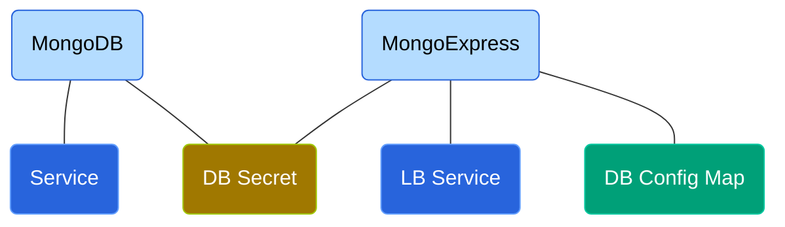
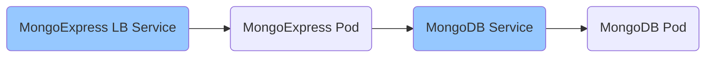

# Introduction

This project configures MongoDB and MongoExpress (An UI for the DB). The MongoExpress uses K8s `Secret` and `ConfigMap` components to access MongoDB service.



# Setup

```bash
> minikube start
> cd ~/GitProjects/Learn/K8s/02-mongo
> run.sh

> kubectl get all
# Pods
# ----------------------------------------------------------------------------------------------------
NAME                                 READY   STATUS    RESTARTS      AGE
pod/mongo-express-5bf4b56f47-lbndj   1/1     Running   2 (18m ago)   19m
pod/mongodb-844789cd64-6twnz         1/1     Running   0             19m

# Services
# ----------------------------------------------------------------------------------------------------
NAME                            TYPE           CLUSTER-IP      EXTERNAL-IP   PORT(S)          AGE
service/kubernetes              ClusterIP      10.96.0.1       <none>        443/TCP          23m
service/mongo-express-service   LoadBalancer   10.108.12.189   <pending>     8081:30000/TCP   19m
service/mongodb-service         ClusterIP      10.97.28.31     <none>        27017/TCP        19m

# Deployments
# ----------------------------------------------------------------------------------------------------
NAME                            READY   UP-TO-DATE   AVAILABLE   AGE
deployment.apps/mongo-express   1/1     1            1           19m
deployment.apps/mongodb         1/1     1            1           19m

# Replicasets
# ----------------------------------------------------------------------------------------------------
NAME                                       DESIRED   CURRENT   READY   AGE
replicaset.apps/mongo-express-5bf4b56f47   1         1         1       19m
replicaset.apps/mongodb-844789cd64         1         1         1       19m

# Opens URL in browser
> minikube service mongo-express-service
|-----------|-----------------------|-------------|-----------------------------|
| NAMESPACE |         NAME          | TARGET PORT |             URL             |
|-----------|-----------------------|-------------|-----------------------------|
| default   | mongo-express-service |        8081 | http://192.168.59.100:30000 |
|-----------|-----------------------|-------------|-----------------------------|

```

# Configuration

A secret is similar to ConfigMap except that the contents of a secret needs to be encoded. Secret are primarily of the following types

- Opaque: Key value pairs
- TLS Certificate: A certificate file used secure (HTTPS) connection

## Secret			

```yaml
##
# Secret
# ------
# data
#  - Key-value pairs where value is base64 encoded
#  - To get a base64 encoding execute: echo -n '<string>' | base64
#  - In this case username/password is admin/welcome1
##
apiVersion: v1
kind: Secret
metadata:
  name: mongodb-secret
type: Opaque
data:
  mongo-root-username: YWRtaW4=
  mongo-root-password: d2VsY29tZTE=
```

## ConfigMap

```yaml
apiVersion: v1
kind: ConfigMap
metadata:
  name: mongodb-configmap
data:
  database_url: mongodb-service
```

## MongoDB Deployment

We need to look at the container documentation to get the names of the mandatory environment variables.

```yaml
##
# spec.template.spec.containers[0].env.name
# 	- Set the environment variable. See container documentation
# 
#  spec.template.spec.containers[0].env.valueFrom.secretKeyRef
#   - The name is metadata.name of the corresponding <secret>.yml
#   - The key is the data.<key> of the corresponding <secret>.yml
##

apiVersion: apps/v1
kind: Deployment
...
spec:
  ...
  template:
    spec:
      containers:
        - name: mongodb
          image: mongo
          ports:
            - containerPort: 27017
          env:
            - name: MONGO_INITDB_ROOT_USERNAME
              valueFrom:
                secretKeyRef:
                  name: mongodb-secret
                  key: mongo-root-username
            - name: MONGO_INITDB_ROOT_PASSWORD
              valueFrom:
                secretKeyRef:
                  name: mongodb-secret
                  key: mongo-root-password
                  
---

apiVersion: v1
kind: Service
metadata:
  name: mongodb-service
spec:
  selector:
    app: mongodb
  ports:
    - protocol: TCP
      port: 27017
      targetPort: 27017
```

## MongoExpress Deployment


```yaml
apiVersion: apps/v1
kind: Deployment
metadata:
  name: mongo-express
  labels:
    app: mongo-express
spec:
  ...
  template:
    ...
    spec:
      containers:
        - name: mongo-express
          image: mongo-express
          ports:
            - containerPort: 8081
          env:
            - name: ME_CONFIG_MONGODB_ADMINUSERNAME
              valueFrom:
                secretKeyRef:
                  name: mongodb-secret
                  key: mongo-root-username
            - name: ME_CONFIG_MONGODB_ADMINPASSWORD
              valueFrom:
                secretKeyRef:
                  name: mongodb-secret
                  key: mongo-root-password
            - name: ME_CONFIG_MONGODB_SERVER
              valueFrom:
                configMapKeyRef:
                  name: mongodb-configmap
                  key: database_url
                  
---

apiVersion: v1
kind: Service
metadata:
  name: mongo-express-service
spec:
  selector:
    app: mongo-express
  type: LoadBalancer
  ports:
    - protocol: TCP
      port: 8081
      targetPort: 8081
      nodePort: 30000
```

## Working

```bash
##
# Services
# --------
#  - mongo-express-service is of type LoadBalancer open for the external world
#  - mongodb-service is an internal service and hence is of type ClusterIP (default)
##

> kubectl get services
kubernetes              ClusterIP      10.96.0.1       <none>        443/TCP          46m
mongo-express-service   LoadBalancer   10.108.12.189   <pending>     8081:30000/TCP   43m
mongodb-service         ClusterIP      10.97.28.31     <none>        27017/TCP        43m

```

When a request is made from the browser the follow is as follows




