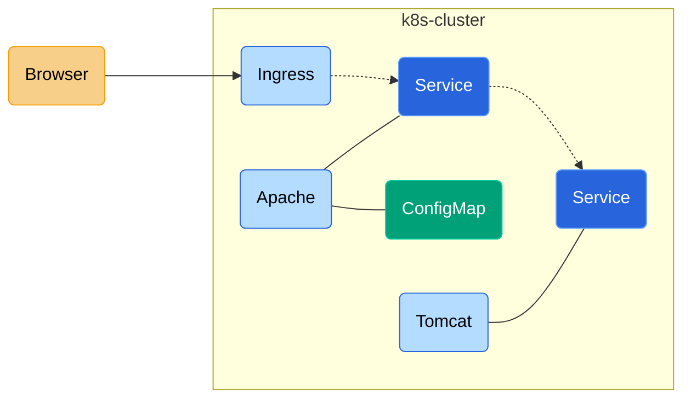

# Introduction

This document describes the deployment created by the project

- Tomcat
  - A Tomcat image `cafeduke/tomcat:9` is built  to include a web-app `duke.war`,  JKS and custom container configuration exposing HTTP and HTTPS virtual-hosts (VH)
  - K8s Deployment creates replicas of Tomcat pods from image `cafeduke/tomcat:9` 
  - K8s Service `tomcat-service` load-balances Tomcat pods. The service provides HTTP and HTTPS endpoints
  - An Apache image `cafeduke/apache:latest` is built  to include static files in `htdocs` and certs. 
- Apache
  - The Apache image `cafeduke/apache:latest`  has configuration that creates 4 VHs to test all combinations of front-end/back-end HTTP/HTTPS.
  - The VHs of Apache route the requests to appropriate `tomcat-service` 
  - K8s ConfigMap is built to store the Apache configuration in K8s cluster.
  - K8s Deployment creates replicas of Apache pods from image `cafeduke/apache:latest` 
  - K8s Service `apache-service` load-balances Apache pods. The service provides 4 endpoints (one for each combination of front-end/back-end HTTP/HTTPS)
- Ingress
  - The ingress accepts traffic from the client (browser) and routes them to services based on routing rules 
  - Ingress shall be the single point of entry into the K8s cluster
  - Routing rules are configured in Ingress
  - An Ingress controller can either serve HTTP backend or HTTPS backend. We have both HTTP and HTTPS Apache services 
  - Thus, two Ingress controllers are created.
    - Ingress `duke-ingress-backend-plain` routes to HTTP services
    - Ingress `duke-ingress-backend-secure` routes to HTTPS services
  - Ideally, SSL can terminate at Ingress. The communication inside the K8s cluster can be HTTP

# Overview




# Setup Environment

- Install and configure minikube -- [details](https://github.com/cafeduke/learn/wiki/K8s-Single-Node-Cluster-with-Minikube)
- Start minikube and enable Ingress

```bash
# 
> minikube version
minikube version: v1.33.1
commit: 5883c09216182566a63dff4c326a6fc9ed2982ff

# Start minikube
> minikube start

# Start ingress
> minikube addons enable ingress
```

# Build container images

- Build `cafeduke/tomcat:9`
- Build `cafeduke/apache:latest`

```bash
# Project root
cd learn/K8s/03-stack-apache-tomcat

# NOTE: the images built are within the minikube K8s cluster

# Build Tomcat
cd images/cafeduke-tomcat
build.sh minikube

# Build Apache
cd images/cafeduke-apache
build.sh minikube

# Verify images inside the minikube cluster
> minikube ssh
$ docker image ls  | grep cafeduke
cafeduke/apache                                      latest     b8d0d48383c6   40 hours ago    112MB
cafeduke/tomcat                                      9          ce152c1f0961   41 hours ago    456MB
```

# K8s services configuration 

## Tomcat

`Deployment` creates replicas of pods containing stateless container `tomcat`. 

```yaml
# -------------------------------------------------------------------------------------------------
# Tomcat
# -------------------------------------------------------------------------------------------------
---
##
# Deployment
##
apiVersion: apps/v1
kind: Deployment
metadata:
  name: tomcat
  labels:
    app: tomcat
spec:
  replicas: 2
  selector:
    matchLabels:
      app: tomcat
  template:
    metadata:
      labels:
        app: tomcat
    spec:
      containers:
        - name: tomcat
          image: cafeduke/tomcat:9
          imagePullPolicy: Never                 # Ensure the image is pulled from local repo
          ports:
            - name: plain-port                   # Name is required when there are multiple containerPorts
              containerPort: 18801
            - name: secure-port
              containerPort: 17701

---
##
# Service
##
apiVersion: v1
kind: Service
metadata:
  name: tomcat-service
spec:
  selector:
    app: tomcat
  type: ClusterIP                                # Change to 'LoadBalancer' for testing
  ports:
    - name: plain-port
      protocol: TCP
      port: 18801
      targetPort: 18801
      nodePort: 30881
    - name: secure-port
      protocol: TCP
      port: 17701
      targetPort: 17701
      nodePort: 30771
---

```


## Apache

`Deployment` creates replicas of pods containing stateless container `apache`. 

```yaml
# -------------------------------------------------------------------------------------------------
# Apache
# -------------------------------------------------------------------------------------------------

##
# Deployment
##
apiVersion: apps/v1
kind: Deployment
metadata:
  name: apache
  labels:
    app: apache
spec:
  replicas: 2
  selector:
    matchLabels:
      app: apache
  template:
    metadata:
      labels:
        app: apache
    spec:
      containers:
        - name: apache
          image: cafeduke/apache:latest
          imagePullPolicy: Never
          ports:
            - name: hh-port
              containerPort: 8801
            - name: hs-port
              containerPort: 8802
            - name: ss-port
              containerPort: 7701
            - name: sh-port
              containerPort: 7702
          volumeMounts:
            - name: apache-conf-volume
              mountPath: /usr/local/apache2/conf
      volumes:
        - name: apache-conf-volume
          configMap:
            name: apache-conf-configmap
---

##
# Service
##
apiVersion: v1
kind: Service
metadata:
  name: apache-service
spec:
  selector:
    app: apache
  type: ClusterIP          # Change to 'LoadBalancer' for testing
  ports:
    - name: hh-port
      protocol: TCP
      port: 8801
      targetPort: 8801
      nodePort: 30081
    - name: hs-port
      protocol: TCP
      port: 8802
      targetPort: 8802
      nodePort: 30082
    - name: ss-port
      protocol: TCP
      port: 7701
      targetPort: 7701
      nodePort: 30071
    - name: sh-port
      protocol: TCP
      port: 7702
      targetPort: 7702
      nodePort: 30072
```

## Ingress

Ingress has routing rules to services. For the ingress the front-end communication is with the client (browser) and back-end communication is with services.

	- An ingress controller can either handle HTTP services or HTTPS services
	- Since we have both type of services, create two ingress controllers  -- One configured to route to HTTP services and other to HTTPS services

```yaml
##
# Ingress (HTTP Backend)
#   - An ingress container that can route to HTTP services
##
apiVersion: networking.k8s.io/v1
kind: Ingress
metadata:
  name: duke-ingress-backend-plain
  namespace: default
  annotations:
    ingressClassName: "nginx"
spec:
  rules:
    - host: duke.com
      http:
        paths:
          - pathType: Prefix
            path: /hh
            backend:
              service:
                name: apache-service
                port:
                  number: 8801
          - pathType: Prefix
            path: /hs
            backend:
              service:
                name: apache-service
                port:
                  number: 8802

---
##
# Ingress (HTTPS Backend)
#   - An ingress container that can route to HTTPS services
##
apiVersion: networking.k8s.io/v1
kind: Ingress
metadata:
  name: duke-ingress-backend-secure
  namespace: default
  annotations:
    ingressClassName: "nginx"
    nginx.ingress.kubernetes.io/backend-protocol: HTTPS
spec:
  rules:
    - host: duke.com
      http:
        paths:
          - pathType: Prefix
            path: /ss
            backend:
              service:
                name: apache-service
                port:
                  number: 7701
          - pathType: Prefix
            path: /sh
            backend:
              service:
                name: apache-service
                port:
                  number: 7702

```

# K8s objects


## Create K8s cluster

```bash
# Project root
cd learn/K8s/03-stack-apache-tomcat

# Create all K8s objects including ConfigMap and Ingress
run.sh
```


## Monitor K8s objects

```bash
# Deployments, Replica-Sets, Pods and Services
# --------------------------------------------
> kubectl get all -o wide
NAME                          READY   STATUS    RESTARTS   AGE   IP            NODE       NOMINATED NODE   READINESS GATES
pod/apache-794ddc8b5c-lnjqw   1/1     Running   0          20s   10.244.0.30   minikube   <none>           <none>
pod/apache-794ddc8b5c-lwl2b   1/1     Running   0          20s   10.244.0.29   minikube   <none>           <none>
pod/tomcat-696dbc9587-4xx6s   1/1     Running   0          20s   10.244.0.31   minikube   <none>           <none>
pod/tomcat-696dbc9587-jqqkq   1/1     Running   0          20s   10.244.0.32   minikube   <none>           <none>

NAME                     TYPE           CLUSTER-IP       EXTERNAL-IP   PORT(S)                                                       AGE     SELECTOR
service/apache-service   LoadBalancer   10.103.106.136   <pending>     8801:30081/TCP,8802:30082/TCP,7701:30071/TCP,7702:30072/TCP   20s     app=apache
service/kubernetes       ClusterIP      10.96.0.1        <none>        443/TCP                                                       8m37s   <none>
service/tomcat-service   LoadBalancer   10.110.221.19    <pending>     18801:30881/TCP,17701:30771/TCP                               20s     app=tomcat

NAME                     READY   UP-TO-DATE   AVAILABLE   AGE   CONTAINERS   IMAGES                   SELECTOR
deployment.apps/apache   2/2     2            2           20s   apache       cafeduke/apache:latest   app=apache
deployment.apps/tomcat   2/2     2            2           20s   tomcat       cafeduke/tomcat:9        app=tomcat

NAME                                DESIRED   CURRENT   READY   AGE   CONTAINERS   IMAGES                   SELECTOR
replicaset.apps/apache-794ddc8b5c   2         2         2       20s   apache       cafeduke/apache:latest   app=apache,pod-template-hash=794ddc8b5c
replicaset.apps/tomcat-696dbc9587   2         2         2       20s   tomcat       cafeduke/tomcat:9        app=tomcat,pod-template-hash=696dbc9587

# Config Maps
# -----------
> kubectl get cm
NAME                    DATA   AGE
apache-conf-configmap   4      18h
kube-root-ca.crt        1      2d

# Ingress
# -------
> kubectl get ingress
NAME                          CLASS    HOSTS      ADDRESS        PORTS   AGE
duke-ingress-backend-plain    <none>   duke.com   192.168.49.2   80      55m
duke-ingress-backend-secure   nginx    duke.com   192.168.49.2   80      55m

# DNS Lookup
# ----------
grep duke.com /etc/hosts
192.168.49.2 duke.com

```

# Test

## Configure DNS lookup

```bash
> grep duke.com /etc/hosts
192.168.49.2 duke.com
```

## Request via Ingress

- Ingress by default listens at 80 (HTTP) and 443 (HTTPS) for client requests
- Since 80 and 443 are default HTTP and HTTPS ports respectively, they can be omitted from the URL

```bash
# Request via 80
# --------------
> jget -f uri.txt -q
http://duke.com:80/hh/duke/hello.jsp, ResponseCode=200
http://duke.com:80/hs/duke/hello.jsp, ResponseCode=200
http://duke.com:80/sh/duke/hello.jsp, ResponseCode=200
http://duke.com:80/ss/duke/hello.jsp, ResponseCode=200


# Request via 443
# ---------------
> jget -ssl -f uri.secure.txt -q
https://duke.com:443/hh/duke/hello.jsp, ResponseCode=200
https://duke.com:443/hs/duke/hello.jsp, ResponseCode=200
https://duke.com:443/sh/duke/hello.jsp, ResponseCode=200
https://duke.com:443/ss/duke/hello.jsp, ResponseCode=200
```

## Request via service 

OHS service cannot be accessed from outside the K8s cluster. Ingress is the single point of contact for the outside world. Thus, we need to SSH into the cluster.

```bash
> minikube ssh

# Request Apache service
# ----------------------

# apache-service IP = 10.103.106.136
$ curl -I http://10.103.106.136:8801/hh/duke/hello.jsp
HTTP/1.1 200 
Date: Fri, 05 Jul 2024 10:51:50 GMT
Server: Apache/2.4.41 (Unix) OpenSSL/1.1.1d
Content-Type: text/html;charset=windows-1252
Transfer-Encoding: chunked
Set-Cookie: JSESSIONID=DBB21CA5AA8EFE8F29476CDD887A7A8F; Path=/duke; HttpOnly

# Request Tomcat service
# ----------------------

# tomcat-service IP = 10.110.221.19
curl -I http://10.110.221.19:18801/duke/hello.jsp
HTTP/1.1 200 
Set-Cookie: JSESSIONID=C76E7D2F0C69E28DAAD7F91DC3CA01C8; Path=/duke; HttpOnly
Content-Type: text/html;charset=windows-1252
Transfer-Encoding: chunked
Date: Fri, 05 Jul 2024 10:52:25 GMT

```


